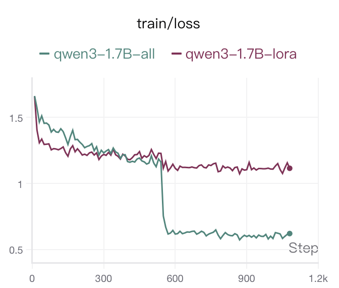
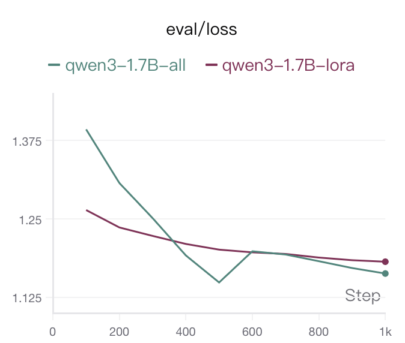
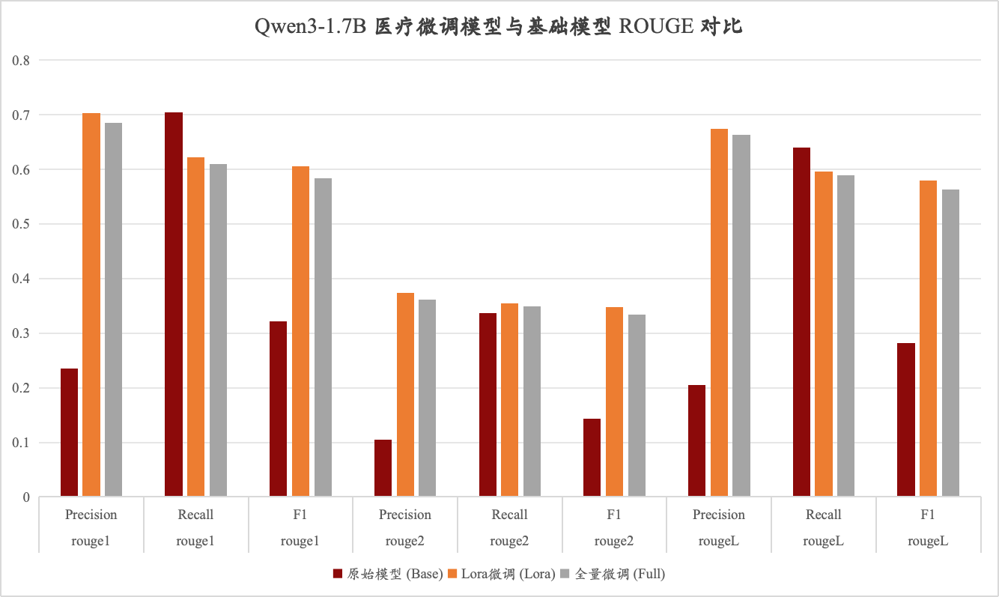
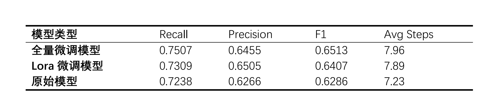

# Qwen3微调实战：医疗R1推理风格聊天 


[](https://swanlab.cn/@ZeyiLin/qwen3-sft-medical/overview)

- **基础模型**：[Qwen3-1.7B](https://modelscope.cn/models/Qwen/Qwen3-1.7B/summary)
<!-- - **微调后模型**：[Qwen3-1.7b-Medical-R1-sft](https://modelscope.cn/models/testUser/Qwen3-1.7b-Medical-R1-sft/summary) -->
- **数据集**：[delicate_medical_r1_data](https://modelscope.cn/datasets/krisfu/delicate_medical_r1_data)
<!-- - **SwanLab**：[qwen3-sft-medical](https://swanlab.cn/@ZeyiLin/qwen3-sft-medical/runs/agps0dkifth5l1xytcdyk/chart) -->
- **微调方式**：全参数微调、LoRA微调
<!-- - **推理风格**：R1推理风格 -->
- **算力要求**：
  - **全参数微调**：32GB显存
  - **LoRA微调**：28GB显存
<!-- - **图文教程**：[Qwen3大模型微调入门实战（完整代码）](https://zhuanlan.zhihu.com/p/1903848838214705484) -->
<!-- - **Jupyter Notebook**：[train.ipynb](train.ipynb) -->

<!-- > 如果需要进一步降低显存需求，可以使用Qwen3-0.6B模型，或调低`MAX_LENGTH`。 -->

## 安装环境

```bash
pip install -r requirements.txt
```

## 数据准备

会自动完成数据集下载、预处理、验证集划分，生成`train.jsonl`，`val.jsonl`以及`test.jsonl`文件，比例是按照8:1:1的划分。

```bash
python data.py
```

## 训练

**全参数微调**
```bash
python train.py
```

**LoRA微调**
```bash
python train_lora.py
```

## 推理

**全参数微调**
```bash
python inference.py
```

**LoRA微调**
```bash
python inference_lora.py
```

## 思维链评估


**全参数微调**
```bash
python evaluate.py
```

**LoRA微调**
```bash
python wj_evaluate_lora.py
```


## Rouge评估

**全参数微调**
```bash
python wj_rouge.py
```

**LoRA微调**
```bash
python wj_lora_rouge.py
```

# 实验结果


<!-- **SwanLab训练日志**：[](https://swanlab.cn/@ZeyiLin/qwen3-sft-medical/overview) -->

## 🧪 微调方法整体对比：全参数微调 vs LoRA

## 1. 训练与验证损失对比

<div style="display: flex; gap: 10px;">
    
    
</div>

经测试，全参数微调在训练损失和验证损失上均优于 LoRA 微调，表现出更快的收敛速度和更稳定的优化过程。

---

## 2. ROUGE 指标对比

<div style="text-align:center;">
    
</div>

从图中可以看到，全参数微调模型在所有 ROUGE 指标上均优于 LoRA 模型和原始模型，尤其在 Precision 和 Recall 上表现突出。
LoRA 微调虽然略低于全量微调，但相较于原始模型仍有明显改善，证明其在医疗文本生成任务中的有效性。

此外，LoRA 在资源消耗上具有显著优势，使其成为一种高效的轻量级替代方案。

---

## 3. 思维链（Chain-of-Thought）评估结果对比

<div style="text-align:center;">
    
</div>

思维链评估结果显示，全参数微调在 Recall 和 Precision 上都有领先优势，说明其生成的推理路径覆盖更多事实信息且准确性更高。

虽然 LoRA 的表现略逊一筹，但仍显著优于原始模型，并与 ROUGE 指标的结论一致，进一步验证了 LoRA 微调在医疗问答任务中的有效性。

---

# 📌 总体结论

- **全参数微调：** 性能最强，收敛稳定，指标全面领先，但训练成本高。
- **LoRA 微调：** 以极低资源开销实现了接近全量微调的性能，是资源受限场景的最佳选择。
- **原始模型：** 各指标最弱，说明医疗领域知识需要针对性微调才能体现效果。

---


## 训练效果预览

```
Question: 
医生，我听说凝血块机化后会对呼吸功能造成损害，这是真的吗？具体是怎么影响的呢？而且，这种影响在不同类型的血胸中有什么不同吗？

LLM:
是的，凝血块机化确实会对呼吸功能造成损害。凝血块机化后，纤维组织会包裹住凝血块，这不仅会限制肺部的扩张，还可能导致肺萎陷，从而影响呼吸功能。在闭合性血胸中，由于血胸积聚在胸腔内，凝血块机化后形成的纤维包裹可能更严重地限制肺部的扩张，而开放性血胸由于血胸量大，凝血块机化后形成的纤维包裹也可能导致更严重的肺萎陷。因此，对于血胸患者，及时的治疗非常重要，包括胸腔闭式引流等措施，以减少对呼吸功能的损害。同时，避免剧烈运动和咳嗽也是预防措施之一。
```


## 相关工具

- [swanlab](https://github.com/SwanHubX/SwanLab)：开源、现代化设计的深度学习训练跟踪与可视化工具
- [transformers](https://github.com/huggingface/transformers)：HuggingFace推出的包含预训练文本、计算机视觉、音频、视频和多模态模型的库，用于推理和训练
- [peft](https://github.com/huggingface/peft)：用于高效微调大型语言模型的库